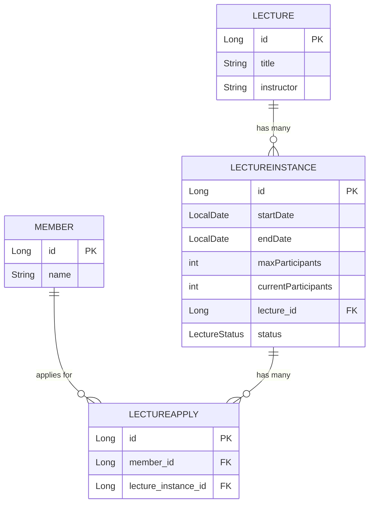

## 프로젝트 구조
```markdown
├── main
│   └── java
│       └── com
│           └── example
│               └── cleancode
│                   ├── CleancodeApplication.java
│                   ├── ServletInitializer.java
│
│                   ├── adapter                           # 외부와의 상호작용 계층
│                   │   ├── in                            # 사용자 요청 처리 (Controller, DTO)
│                   │   │   ├── controller
│                   │   │   │   ├── LectureApplyController.java
│                   │   │   │   ├── LectureController.java
│                   │   │   │   └── LectureInstanceController.java
│                   │   │   ├── dto
│                   │   │   │   ├── LectureApplyDto.java
│                   │   │   │   ├── LectureDto.java
│                   │   │   │   ├── LectureInstanceDto.java
│                   │   │   │   └── MemberDto.java
│                   │   └── out                           # 데이터베이스, 외부 시스템과의 상호작용
│                   │       └── repository
│                   │           ├── LectureApplyRepositoryImpl.java
│                   │           ├── LectureInstanceRepositoryImpl.java
│                   │           └── LectureRepositoryImpl.java
│
│                   ├── application                       # 비즈니스 로직을 처리하는 계층
│                   │   ├── mapper                        # 데이터 변환을 담당
│                   │   │   ├── LectureApplyMapper.java
│                   │   │   ├── LectureInstanceMapper.java
│                   │   │   ├── LectureMapper.java
│                   │   │   └── MemberMapper.java
│                   │   ├── service                       # 비즈니스 로직 구현
│                   │   │   ├── LectureApplyService.java
│                   │   │   ├── LectureInstanceService.java
│                   │   │   └── LectureService.java
│                   │   ├── useCase                       # 특정 유스케이스 처리
│                   │   │   ├── LectureApplyUseCaseService.java
│                   │   │   ├── LectureInstanceUseCaseService.java
│                   │   │   └── LectureUseCaseService.java
│                   │   └── repository                    # 데이터 접근 인터페이스 정의
│                   │       ├── LectureApplyRepository.java
│                   │       ├── LectureInstanceRepository.java
│                   │       └── LectureRepository.java
│
│                   ├── domain                            # 핵심 비즈니스 도메인 모델 계층
│                   │   ├── Lecture.java
│                   │   ├── LectureApply.java
│                   │   ├── LectureInstance.java
│                   │   ├── LectureStatus.java
│                   │   └── Member.java
│
│                   └── infrastructure                    # 기술적 설정 및 지원 계층
│                       └── util
│                           └── config
│                               └── QueryDslConfig.java
└── resources                                              # 설정 파일 및 초기 데이터 스크립트
├── application.yml
├── data.sql
└── schema.sql

```

# 프로젝트 구조 분석

이 프로젝트는 Java 기반 Spring Boot 애플리케이션으로 **클린 아키텍처**를 따르고 있습니다. 각 계층은 명확한 책임을 가지며, 애플리케이션의 확장성과 유지보수성을 높이기 위해 역할이 분리되어 있습니다.


## 계층별 역할

### 1. **Adapter (입출력 어댑터 계층)**
외부 시스템이나 사용자로부터 입력을 받고, 응답을 돌려주는 역할을 담당합니다.
- **Controller**: 클라이언트 요청을 받아서 처리.
- **DTO**: 데이터를 전송하거나 받는 객체.
- **RepositoryImpl**: 데이터베이스 접근 구현체로, 실제 DB와의 상호작용을 담당.

### 2. **Application (애플리케이션 서비스 계층)**
비즈니스 로직을 처리하고, 각 도메인 객체 간의 상호작용을 조정합니다.
- **Service**: 비즈니스 로직의 핵심 처리.
- **Mapper**: 엔티티와 DTO 간의 변환을 담당.
- **UseCase**: 특정 시나리오나 사용자 요구 사항에 맞춰 비즈니스 로직을 처리.
- **Repository**: 도메인 레벨에서 데이터 접근을 추상화한 인터페이스.

### 3. **Domain (도메인 계층)**
핵심 비즈니스 규칙과 데이터를 담고 있는 엔티티들로 구성됩니다.
- **Entity (Lecture, LectureApply 등)**: 비즈니스에서 중요한 개념을 표현하는 객체들.
- **LectureStatus (Enum)**: 강의 상태와 같은 비즈니스 규칙을 표현.

### 4. **Infrastructure (인프라 계층)**
애플리케이션의 기술적 세부사항을 관리합니다.
- **Config**: 설정 및 기술적 지원을 위한 구성 (e.g., QueryDSL 설정).

### 5. **Resources (리소스 계층)**
애플리케이션의 설정 파일과 데이터베이스 초기화 스크립트를 포함합니다.
- **application.yml**: 환경 설정 파일.
- **schema.sql & data.sql**: 데이터베이스 스키마 및 초기 데이터.

## 요약
- **Adapter**: 외부 입력/출력 담당.
- **Application**: 비즈니스 로직 처리 및 도메인 간 상호작용 조정.
- **Domain**: 비즈니스 핵심 규칙과 데이터.
- **Infrastructure**: 기술적 설정 및 지원.


# 클린 아키텍처의 장점과 단점

## 장점

### 1. **유지보수성 향상**
각 계층이 명확한 책임을 가지기 때문에 코드의 변경이 필요한 경우, 특정 계층만 수정하면 됩니다. 특히, 도메인 계층과 애플리케이션 계층은 외부 기술이나 UI와 독립적으로 설계되어 있어, 비즈니스 로직을 수정할 때 UI나 DB 관련 코드를 건드리지 않아도 됩니다.

### 2. **확장성 및 유연성**
애플리케이션이 성장하거나 새로운 요구사항이 추가될 때, 특정 계층만 확장하면 됩니다. 예를 들어, 다른 종류의 데이터베이스나 외부 API를 추가할 때도 어댑터 계층만 수정하거나 추가하면 되므로 전체 시스템에 영향을 주지 않습니다.

### 3. **테스트 용이성**
클린 아키텍처는 비즈니스 로직을 UI, 데이터베이스 등 외부 의존성과 분리하여, 유닛 테스트가 용이합니다. 특히 **도메인 계층**과 **애플리케이션 계층**은 외부 시스템에 의존하지 않기 때문에 빠르고 안정적인 테스트가 가능합니다.

### 4. **재사용성 증가**
클린 아키텍처는 비즈니스 로직과 외부 시스템 간의 의존성을 최소화합니다. 이로 인해 특정 도메인 로직이나 유스케이스는 여러 프로젝트에서 쉽게 재사용할 수 있습니다. 어댑터나 인프라 계층만 변경하여 다양한 환경에서도 재사용 가능합니다.

### 5. **의존성 역전 (Dependency Inversion)**
하위 계층(어댑터, 인프라)이 상위 계층(도메인, 애플리케이션)에 의존하지 않고, 반대로 도메인 계층이 외부의 변화에 의존하지 않는 구조를 통해 핵심 비즈니스 로직이 외부 시스템의 영향을 받지 않도록 설계됩니다.

## 단점

### 1. **복잡성 증가**
프로젝트가 작거나 단순한 경우에는 클린 아키텍처의 계층 분리가 오히려 과도할 수 있습니다. 작은 애플리케이션에도 여러 계층을 나누다 보면 **초기 설정**과 **구현 비용**이 증가하게 됩니다.

### 2. **초기 학습 곡선**
클린 아키텍처의 개념과 계층화된 설계는 초기에 이해하기 어려울 수 있습니다. 특히 이 패턴을 처음 접하는 개발자나 팀의 경우, 설계 철학을 숙지하고 코드에 반영하는 데 시간이 필요합니다.

### 3. **오버엔지니어링 위험**
애플리케이션이 지나치게 작은 경우, 지나친 계층 분리는 오버엔지니어링으로 이어질 수 있습니다. 단순히 CRUD 기능만 필요한 프로젝트에서 도메인, 애플리케이션, 어댑터 계층을 모두 도입하면 개발 속도가 느려지고 코드가 불필요하게 복잡해질 수 있습니다.

### 4. **개발 속도 저하**
초기 단계에서 각 계층을 설계하고 구현하는 데 시간이 많이 걸립니다. 이를 통해 얻는 이점은 장기적인 유지보수에 도움이 되지만, 단기 프로젝트나 MVP(최소 기능 제품)에는 속도를 저하시킬 수 있습니다.

## 결론

클린 아키텍처는 **대규모 애플리케이션**에서 특히 유리하며, **유지보수성**, **확장성**, **테스트 용이성**을 제공하는 강력한 아키텍처입니다. 하지만, 작은 프로젝트에서는 그 복잡성이 오히려 단점이 될 수 있습니다. 따라서 프로젝트의 규모와 요구사항에 맞춰 클린 아키텍처의 적용 여부를 결정하는 것이 중요합니다.


## ERD



# ERD (Entity Relationship Diagram) 설명

## 1. Lecture
- **Lecture**는 강의를 나타내는 엔티티입니다. 한 개의 강의는 여러 번 개설될 수 있으며, `LectureInstance`와 관계를 맺습니다.

  ### 필드
   - `id`: Long (PK) - 강의의 고유 식별자
   - `title`: String - 강의 제목
   - `instructor`: String - 강의 강사 정보

---

## 2. Member
- **Member**는 시스템의 사용자를 나타내며, 강의에 신청할 수 있는 학생을 표현합니다. `LectureApply`와 관계를 맺어 강의 신청 기록을 추적합니다.

  ### 필드
   - `id`: Long (PK) - 회원의 고유 식별자
   - `name`: String - 회원 이름

---

## 3. LectureInstance
- **LectureInstance**는 특정 `Lecture`의 인스턴스입니다. 한 개의 강의는 여러 번 개설될 수 있으며, 각각이 `LectureInstance`로 관리됩니다. 또한, 상태(`status`) 필드로 강의의 현재 상태를 추적할 수 있습니다.

  ### 필드
   - `id`: Long (PK) - 강의 인스턴스의 고유 식별자
   - `startDate`: LocalDate - 강의 시작일
   - `endDate`: LocalDate - 강의 종료일
   - `maxParticipants`: int - 최대 수용 인원
   - `currentParticipants`: int - 현재 수강 중인 인원
   - `lecture_id`: Lecture (FK) - 어떤 `Lecture`의 인스턴스인지를 나타냅니다.
   - `status`: LectureStatus (Enum) - 강의 상태 (예: 진행 중, 종료 등)

---

## 4. LectureApply
- **LectureApply**는 학생이 특정 강의 인스턴스에 신청한 기록을 나타냅니다. `Member`와 `LectureInstance`와의 관계를 맺고 있으며, 다대다 관계를 중재하는 역할을 합니다.

  ### 필드
   - `id`: Long (PK) - 신청의 고유 식별자
   - `member_id`: Member (FK) - 신청한 회원을 나타냅니다.
   - `lecture_instance_id`: LectureInstance (FK) - 신청된 강의 인스턴스를 나타냅니다.

---

# 관계 설명
1. **Lecture와 LectureInstance의 관계**:
   - 한 개의 강의(`Lecture`)는 여러 번 개설될 수 있으며, 각각은 별도의 `LectureInstance`로 관리됩니다.

2. **Member와 LectureApply의 관계**:
   - 한 명의 회원(`Member`)은 여러 강의 인스턴스에 신청할 수 있습니다. 각 신청 기록은 `LectureApply`에 저장됩니다.

3. **LectureInstance와 LectureApply의 관계**:
   - 한 개의 강의 인스턴스(`LectureInstance`)에는 여러 학생이 신청할 수 있습니다. 이 관계는 `LectureApply`를 통해 관리됩니다.


